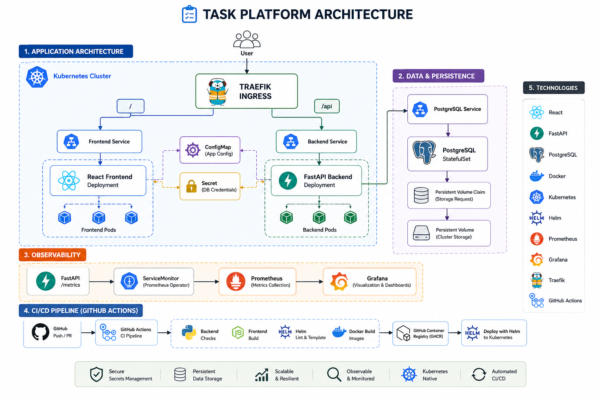

# Task Platform

A production-style task management application built to demonstrate containerization, Kubernetes orchestration, observability, Helm packaging, and continuous integration.

## Overview

Task Platform is a three-tier application consisting of:

- React frontend
- FastAPI backend
- PostgreSQL database

The application is containerized with Docker, deployed to Kubernetes, exposed through Traefik Ingress, monitored with Prometheus and Grafana, packaged using Helm, and validated through GitHub Actions.

## Architecture



## Features

- Task creation, completion, listing, and deletion
- Multi-stage Docker builds
- Docker Compose local environment
- Kubernetes Deployments and Services
- PostgreSQL StatefulSet with persistent storage
- ConfigMaps and Secrets
- Readiness and liveness probes
- Resource requests and limits
- Traefik Ingress with path-based routing
- Prometheus application metrics
- Grafana dashboard
- Helm deployment
- GitHub Actions CI pipeline

## Technology Stack

| Area | Technology |
|---|---|
| Frontend | React, Vite, Axios, Nginx |
| Backend | FastAPI, SQLAlchemy, Uvicorn |
| Database | PostgreSQL |
| Containers | Docker, Docker Compose |
| Kubernetes | Kind, Deployments, StatefulSets, Services, Ingress |
| Packaging | Helm |
| Monitoring | Prometheus, Grafana, ServiceMonitor |
| CI | GitHub Actions |

## Application Architecture

Traffic enters through Traefik Ingress:

- `/` routes to the React frontend
- `/api` routes to the FastAPI backend
- `/metrics` exposes Prometheus metrics

The backend communicates with PostgreSQL through Kubernetes DNS and the internal PostgreSQL Service.

## Local Development

### Requirements

- Docker
- Docker Compose

### Start the platform

```bash
docker compose up --build