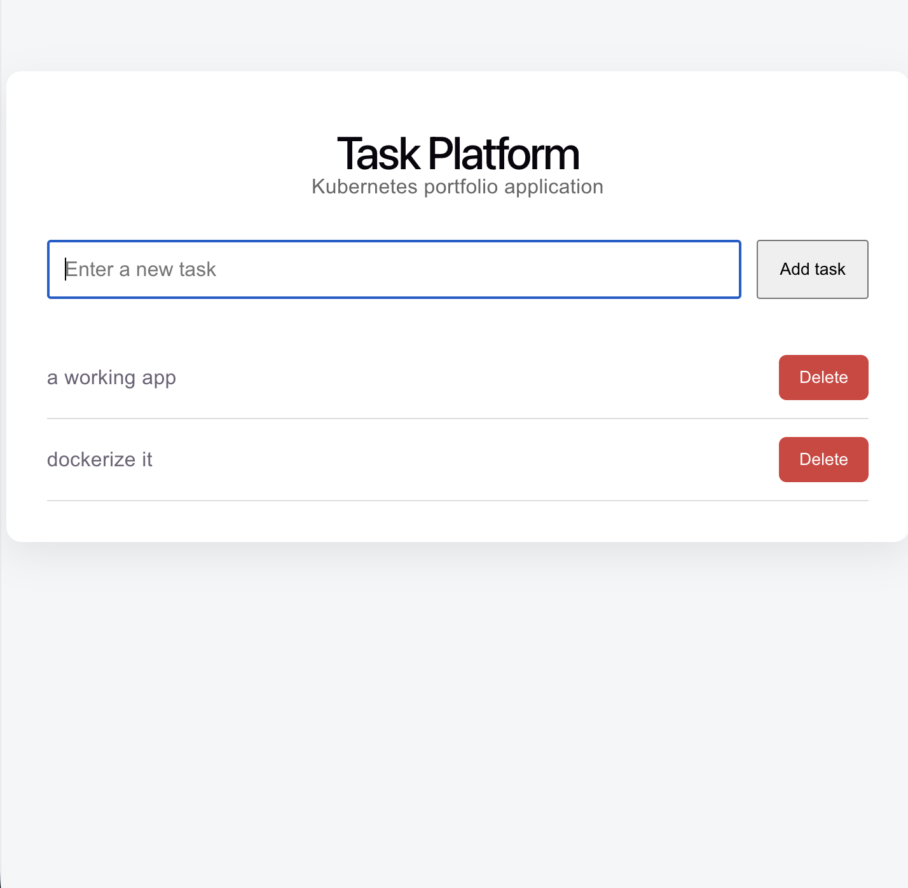
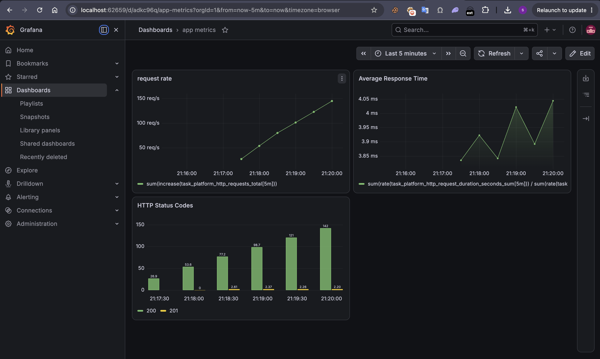
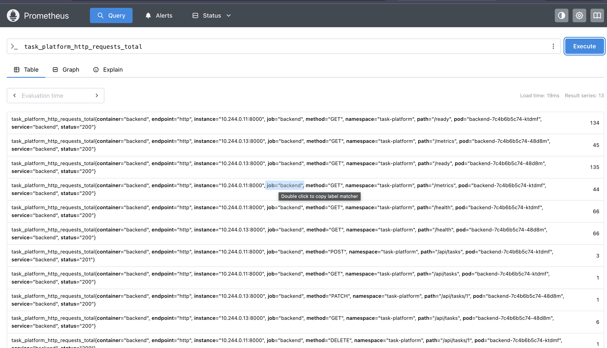
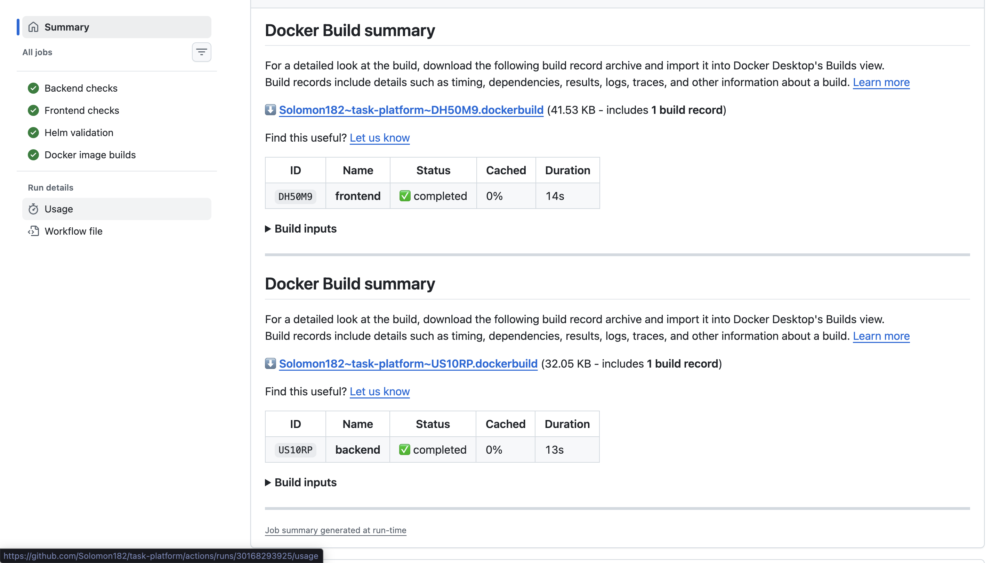

# 🚀 Task Platform

<p align="center">

A production-style cloud-native task management platform built with **React**, **FastAPI**, **PostgreSQL**, **Docker**, **Kubernetes**, **Helm**, **Prometheus**, **Grafana**, and **GitHub Actions**.

</p>

<p align="center">


</p>

---

# 📖 Overview

Task Platform is a production-style full-stack application designed to demonstrate modern DevOps and cloud-native engineering practices.

The application consists of:

- React frontend
- FastAPI backend
- PostgreSQL database

The platform is containerized with Docker, orchestrated with Kubernetes, exposed through Traefik Ingress, monitored with Prometheus & Grafana, packaged using Helm, and continuously validated using GitHub Actions.

---

# 🏗 Architecture

<p align="center">

</p>

---

# 📸 Screenshots

## Application

<p align="center">

</p>

---


## Grafana Dashboard

<p align="center">

</p>

---

## Prometheus Targets

<p align="center">

</p>

---

## GitHub Actions Pipeline

<p align="center">

</p>

---


# ✨ Features

- Full CRUD Task Management
- React + FastAPI architecture
- PostgreSQL persistent storage
- Dockerized services
- Docker Compose local development
- Kubernetes Deployments
- PostgreSQL StatefulSet
- Persistent Volume Claims
- ConfigMaps & Secrets
- Resource Requests & Limits
- Readiness & Liveness Probes
- Traefik Ingress
- Helm Chart
- Prometheus Metrics
- Grafana Dashboards
- GitHub Actions CI Pipeline

---

# ⚙ Technology Stack

| Layer | Technology |
|---------|------------|
| Frontend | React + Vite |
| Backend | FastAPI |
| Database | PostgreSQL |
| ORM | SQLAlchemy |
| Containerization | Docker |
| Local Development | Docker Compose |
| Container Orchestration | Kubernetes (Kind) |
| Package Management | Helm |
| Ingress | Traefik |
| Monitoring | Prometheus |
| Visualization | Grafana |
| CI | GitHub Actions |

---

# 📂 Project Structure

```text
task-platform/

├── backend/
├── frontend/
├── kubernetes/
├── helm/
│   └── task-platform/
├── monitoring/
├── docs/
├── diagrams/
├── screenshots/
├── .github/
│   └── workflows/
├── docker-compose.yml
├── README.md
└── LICENSE
```

---

# 🚀 Local Development

## Clone Repository

```bash
git clone https://github.com/Solomon182/task-platform.git

cd task-platform
```

---

## Run using Docker Compose

```bash
docker compose up --build
```

Application

```
http://localhost:3000
```

Backend API

```
http://localhost:8000/docs
```

---

# ☸ Kubernetes Deployment

## Build Images

```bash
docker build -t task-platform-backend:v2 ./backend

docker build -t task-platform-frontend:v4 ./frontend
```

Load into Kind

```bash
kind load docker-image task-platform-backend:v2 --name kind

kind load docker-image task-platform-frontend:v4 --name kind
```

Deploy

```bash
helm upgrade --install task-platform \
  helm/task-platform \
  --namespace task-platform \
  --create-namespace
```

Run Traefik

```bash
kubectl port-forward -n traefik service/traefik 8080:80
```

Open

```
http://task-platform.local:8080
```

---

# 📈 Monitoring

Prometheus scrapes the backend metrics endpoint.

Metrics include:

- HTTP Request Count
- Request Duration
- HTTP Status Codes

Grafana visualizes:

- Request Count
- Request Duration
- HTTP Status Distribution
- CPU Usage
- Memory Usage
- Pod Health

---

# 🔄 Continuous Integration

Every push triggers GitHub Actions which performs:

✅ Backend Validation

✅ Frontend Build

✅ Helm Lint

✅ Helm Template Validation

✅ Docker Image Build

---

# 🛠 Challenges Solved

During development, several real-world Kubernetes and DevOps issues were encountered and resolved.

Examples include:

- Docker Hub timeout while building images
- Kubernetes DNS resolution failures
- Missing Services
- Missing ConfigMaps
- Missing Secrets
- PostgreSQL connection failures
- Docker image cache issues
- FastAPI 400 Bad Request debugging
- Liveness Probe failures
- Readiness Probe failures
- Ingress routing problems
- Helm deployment issues
- Service vs Ingress networking mistakes

A detailed troubleshooting guide is available in:

```
docs/troubleshooting.md
```

---

# 🔮 Future Improvements

- Horizontal Pod Autoscaler
- Argo CD GitOps Deployment
- GitHub Container Registry
- TLS Certificates
- Alertmanager Notifications
- Integration Tests
- Production Deployment on Cloud Kubernetes

---

# 👨‍💻 Author

**Solomon Aleminh**

DevOps Engineer | Kubernetes | Docker | CI/CD | OpenShift | Cloud Native

GitHub:

```
https://github.com/YOUR_USERNAME
```

---

# ⭐ If you found this project interesting...

Give it a ⭐ on GitHub!